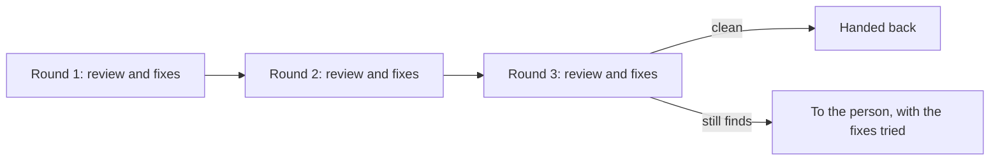

```mermaid
flowchart LR
  r1[Round 1: review and fixes] --> r2[Round 2: review and fixes]
  r2 --> r3[Round 3: review and fixes]
  r3 -->|clean| done[Handed back]
  r3 -->|still finds| person[To the person, with the fixes tried]
```
