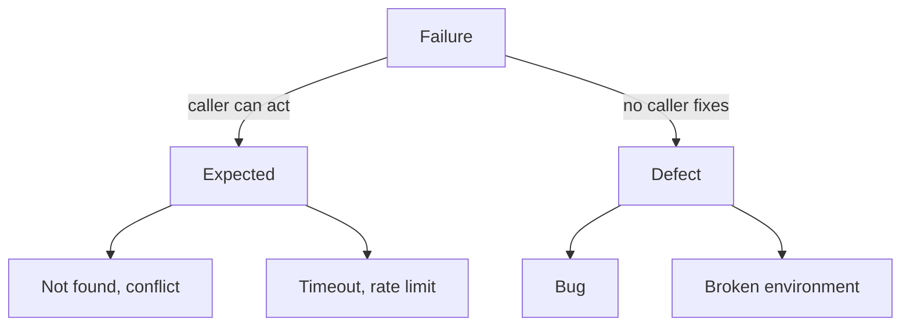

```mermaid
flowchart TD
  failure[Failure] -->|caller can act| expected[Expected]
  failure -->|no caller fixes| defect[Defect]
  expected --> foreseen[Not found, conflict]
  expected --> transient[Timeout, rate limit]
  defect --> bug[Bug]
  defect --> environment[Broken environment]
```
