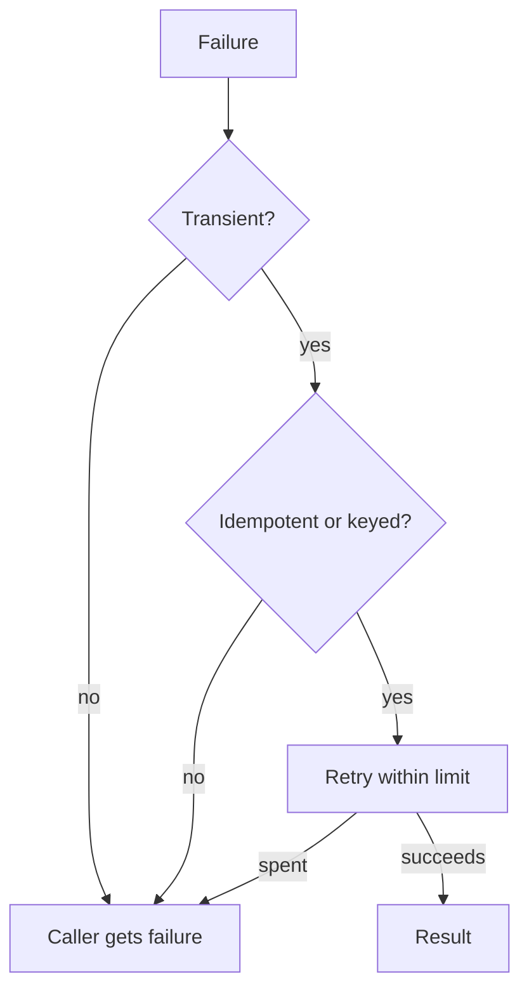

```mermaid
flowchart TD
  failure[Failure] --> transient{Transient?}
  transient -->|no| caller[Caller gets failure]
  transient -->|yes| safe{Idempotent or keyed?}
  safe -->|no| caller
  safe -->|yes| retry[Retry within limit]
  retry -->|spent| caller
  retry -->|succeeds| done[Result]
```
