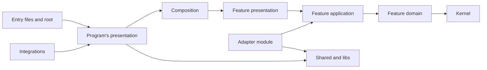

```mermaid
flowchart LR
  entries[Entry files and root] --> presentation[Program's presentation]
  integrations[Integrations] --> presentation
  presentation --> composition[Composition]
  composition --> featurePresentation[Feature presentation]
  featurePresentation --> application[Feature application]
  application --> domain[Feature domain]
  domain --> kernel[Kernel]
  infrastructure[Adapter module] --> application
  presentation --> shared[Shared and libs]
  infrastructure --> shared
```
