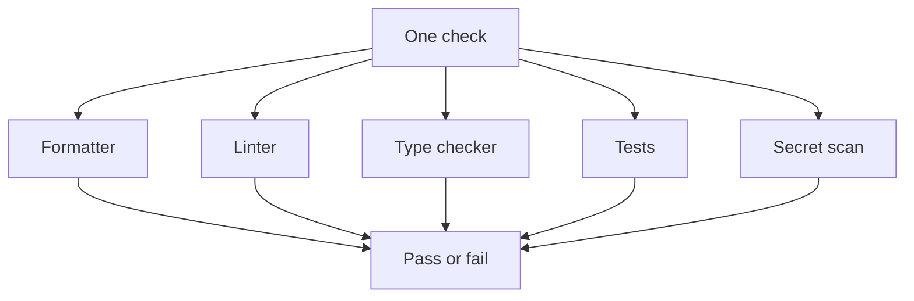

```mermaid
flowchart TD
  check[One check] --> format[Formatter]
  check --> lint[Linter]
  check --> types[Type checker]
  check --> tests[Tests]
  check --> secrets[Secret scan]
  format & lint & types & tests & secrets --> verdict[Pass or fail]
```
