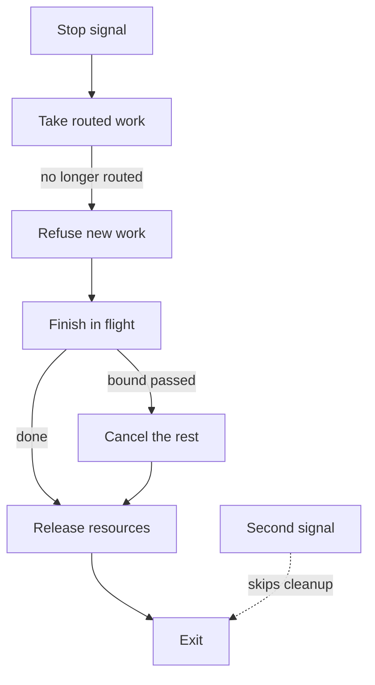

```mermaid
flowchart TD
  signal[Stop signal] --> route[Take routed work]
  route -->|no longer routed| refuse[Refuse new work]
  refuse --> finish[Finish in flight]
  finish -->|done| release[Release resources]
  finish -->|bound passed| cancel[Cancel the rest]
  cancel --> release
  release --> exit[Exit]
  second[Second signal] -.->|skips cleanup| exit
```
